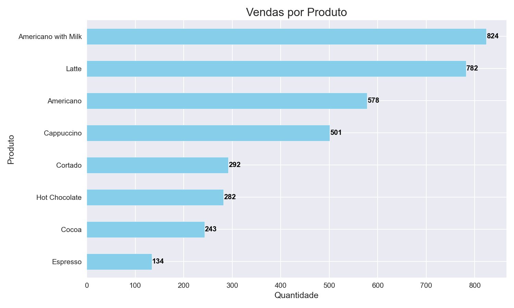
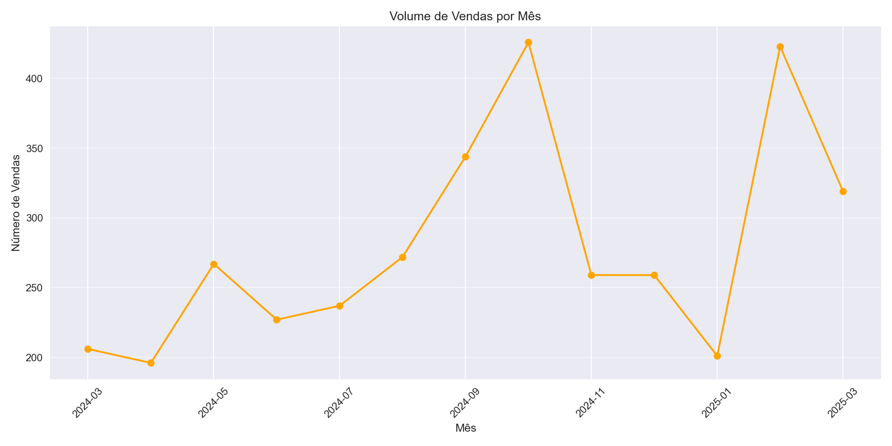
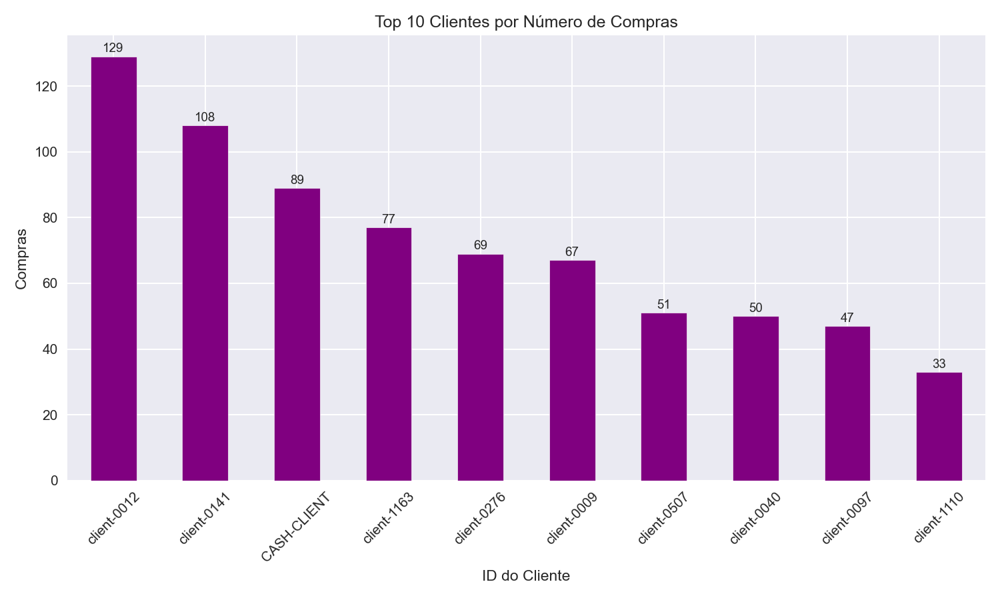

# ☕ Coffee Sales Analysis

Este projeto realiza uma análise completa das vendas de uma cafeteria a partir do arquivo `coffee_sales.csv`. O objetivo é extrair insights valiosos sobre produtos mais vendidos, comportamento de clientes, tendências sazonais e métodos de pagamento.

Feito com Python: `pandas`, `matplotlib`, `seaborn`.

---

## Insights Principais

- ✅ **Produto mais vendido**: Cortado
- 💰 **Produto com maior receita**: Latte (devido ao preço mais alto)
- 📈 **Pico de vendas**: Agosto de 2024
- 💳 **90% das vendas são com cartão**
- 👤 **Clientes fiéis**: Alguns clientes compram diariamente (ex: ANON-0000-0000-0141)
- 🧋 **Ticket médio**: R$ 28,50

## 🕰️ Análise por Horário do Dia

| Período | Comportamento |
|--------|-------------|
| **Manhã (5h–12h)** | Alta demanda por Cortado e Americano |
| **Tarde (12h–18h)** | Cresce o consumo de Latte e Cappuccino |
| **Noite (18h–5h)** | Preferência por Hot Chocolate e produtos doces |

➡️ Isso indica que a cafeteria pode:
- Fazer promoções matinais de "Combo Café + Pão"
- Oferecer descontos em produtos doces à noite
- Estender horário com foco em chocolate quente nos finais de semana

---

## Estrutura do Projeto
# coffee-sales-analysis

- **data/** → Dados brutos
- **notebooks/** → Notebook Jupyter com análise completa
- **src/** → Scripts modulares
- **outputs/** → Dados limpos e gráficos
- **README.md**
- **requirements.txt**
- **LICENSE**


---

## Visualizações

### Vendas por Produto


### Evolução de Vendas ao Longo do Tempo


### Top 10 Clientes por Compras


---

## 🚀 Como Executar

1. Clone o repositório:
```bash
git clone https://github.com/leoglima/coffee_sales_analysis.git
cd coffee-sales-analysis
```
---
## Licença

Este projeto está licenciado sob os termos da [MIT License](./LICENSE).